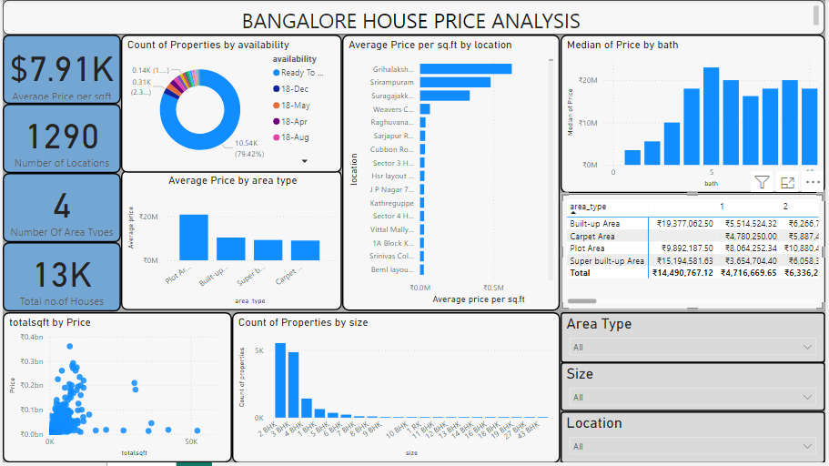

# Bangalore House Price Analysis

## Project Overview
This project analyzes and visualizes house price trends in Bangalore using Power BI. The dataset contains information such as house size (BHK), total square footage, price, number of baths, and balconies. The goal is to uncover insights into house prices based on factors like location, BHK size, square footage, and availability status.

## Dataset
The dataset includes the following columns:
- **Area Type**: The type of area (e.g., built-up, super built-up).
- **Availability**: Whether the property is ready-to-move or available at a future date.
- **Location**: The neighborhood or locality of the property.
- **Size (BHK)**: The size of the house (e.g., 2 BHK, 3 BHK).
- **Total Sqft**: The total area of the house in square feet.
- **Number of Baths**: The number of bathrooms in the house.
- **Number of Balconies**: The number of balconies.
- **Price**: The price of the property in lakhs.

## Key Insights and Visualizations
The Power BI dashboard contains the following visualizations to analyze house prices:

1. **House Availability Status (Pie Chart)**: Displays the proportion of properties that are ready-to-move vs. available in the future.
   
2. **Price Distribution by Area Type**: A bar chart that shows how prices vary across different types of areas (e.g., built-up, super built-up).

3. **Price per Sqft by Location**: A map or bar chart showing how much each location charges per square foot, offering a visual comparison of location-wise price differences.

4. **Price by Number of Baths**: A column chart showing how prices change based on the number of bathrooms in the property.

5. **Scatter Plot of Price vs. Total Square Feet**: A scatter plot showing the relationship between the size of the house (in sqft) and its price, indicating trends and outliers.

6. **Count of Properties by Size (BHK)**: A column chart showing the number of properties available for each BHK size.

7. **Price by Area Type and Number of Baths (Matrix)**: A matrix showing how prices vary depending on both the area type and the number of bathrooms.

## Data Cleaning & Transformation
The following data cleaning and transformation steps were performed:
- **Handling Missing Data**: Removed or imputed missing values for key attributes like size, price, and square footage.
- **Converting Total Sqft to Numeric**: Removed ranges in the `Total Sqft` column and replaced them with average values. Converted values from acres to square feet where necessary.
- **Price in Lakhs**: Prices were assumed to be in lakhs and were multiplied by 100,000 to reflect actual values in rupees.
- **BHK Size Extraction**: Extracted numeric values from the `Size` column (e.g., converting "2 BHK" to 2).

**Link to Dataset** https://www.kaggle.com/code/ameythakur20/bangalore-house-price-prediction-model/input

 

